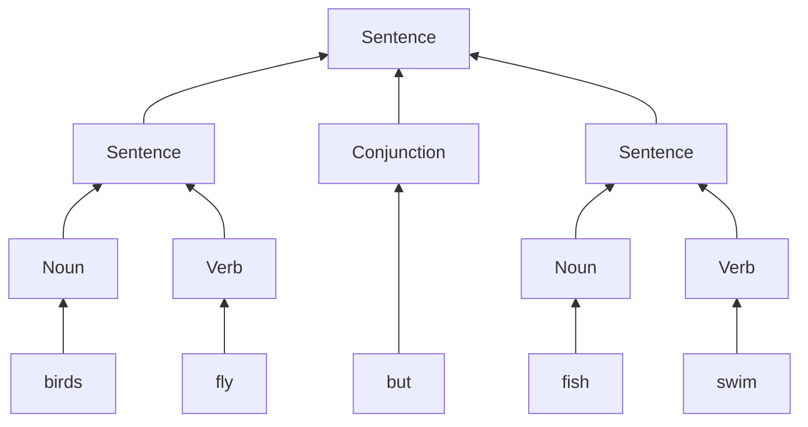

# [Docs] English Grammar

English grammar in the book:

```
Sentence:
    Noun Verb
    Sentence Conjunction Sentence
Conjunction:
    "and"
    "or"
    "but"
Noun:
    NounDic
    Determiner NounDic
Determiner:
    "the"
NounDic:
    "birds"
    "fish"
    "C++"
Verb:
    "rules"
    "fly"
    "swim"
```

A sentence like "birds fly but fish swim" will be like:

