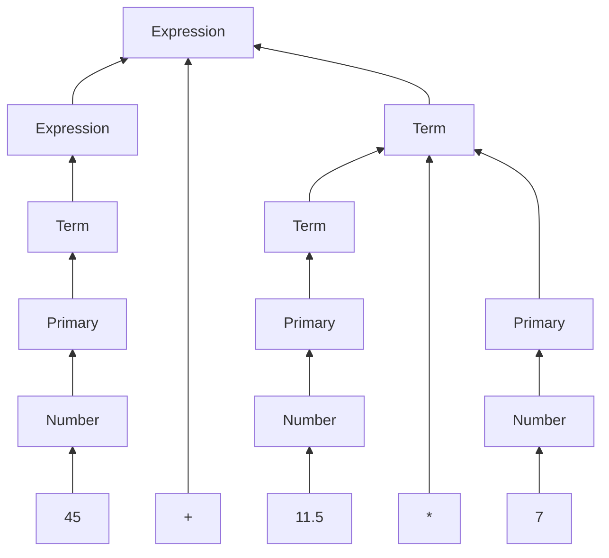

# [Docs] Calculator 1.0

We build a prototype of calculator in chapter 6, and trying to follow the instruction of PPP book to design a basic grammar for this calculator, like following:

To support for factorial calculating, we need to re-design this grammar, which means should add an additional layer between `Term` and `Primary`.

```
Calculation:
    Statement
    Help
    Print
    Quit
    Calculation Statement
Help:
    "H"
Print:
    ";"
Quit:
    "exit"
Statement:
    Declaration
    Expression
Declaration:
    "#" Name "=" Expression
    "#" "const" Name "=" Expression
Expression:
    Term
    Expression "+" Term
    Expression "-" Term
Term:
    Primary
    Term "*" Primary
    Term "/" Primary
    Term "%" Primary
Primary:
    SubPrimary
    SubPrimary "!"
SubPrimary:
    Number
    Name
    Name "=" Expression
    "(" Expression ")"
    "{" Expression "}"
    "+" SubPrimary
    "-" SubPrimary
    # "P" is for "Permutation", "C" is for "Combination"
    "P" "(" Expression "," Expression ")"
    "C" "(" Expression "," Expression ")"
    # "sqrt" is for "Square Root"
    "sqrt" "(" Expression ")"
Number:
    floating-point-literal
Name:
    string-literal
```

We say, the basic element for an `Expression` is a `Number`, and we borrow the floating number from C++.

Here's an example for the parser above, what will happen when the grammar is trying to parse an `Expression` -- `45 + 11.5 * 7`:



TODO List
- [ ] Implement custom define function, with dynamic params and can use global variables -- low priority