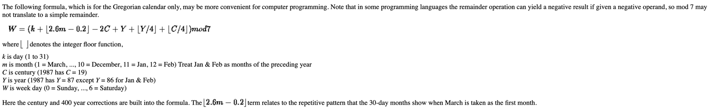

# Date reference

- In namespace Chrono, we add a function named `Day day_of_week(const Date& d)`.
  - In this function, we used a formula, and you can get the reference from [this website](https://cs.uwaterloo.ca/~alopez-o/math-faq/node73.html)
  